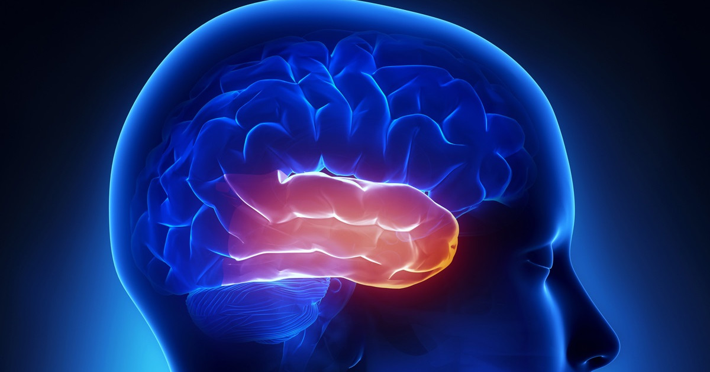

The temporal lobe of the brain is responsible for a number of important functions, including hearing, language processing, and memory. One of the key regions within the temporal lobe is the superior temporal gyrus, which is involved in the perception of speech and the recognition of different sounds. Another important region is the hippocampus, which plays a critical role in the formation and retrieval of long-term memories.

In recent years, researchers have been working to recreate the functions of the temporal lobe in modern AI systems, particularly in the development of chatbots. One approach is to use machine learning algorithms to train chatbots to recognize and respond to different sounds and speech patterns, much like the superior temporal gyrus does in the human brain. Another approach is to use neural networks to simulate the process of memory formation and retrieval, allowing chatbots to "remember" past interactions and use that information to respond more intelligently to new inputs.

There are a lot of challenges in recreating temporal lobe functions in chat bots, such as the lack of data and computational resources and the complexity of the human brain. However, with the recent advancements in AI, especially the natural language processing and deep learning, chat bots are becoming more and more sophisticated in terms of understanding and generating human-like language, and also in terms of memory and context handling.

Overall, the temporal lobe plays a vital role in human cognition and researchers are working to replicate its functions in modern AI systems to make chat bots more natural and intuitive in their interactions with humans.

# The benifits of Temporal Project 

Using OpenAI's Whisper to listen to Twitch streams could be revolutionary in the field of Twitch bots. Whisper is a natural language model that can understand and generate human-like speech, allowing Twitch bots to understand and respond to the voice chat in real-time. 

This could enable Twitch bots to perform a variety of tasks such as moderating, providing information about the game, and even interacting with viewers in a more natural way. This could provide valuable insights for streamers and help them improve their content and engage with their audience more effectively. 

All in all, the use of OpenAI's Whisper to listen to Twitch streams and advance Twitch bots has the potential to revolutionize the way Twitch is experienced by both streamers and viewers.