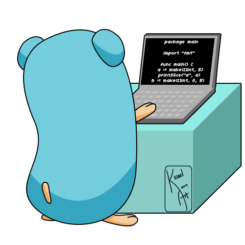
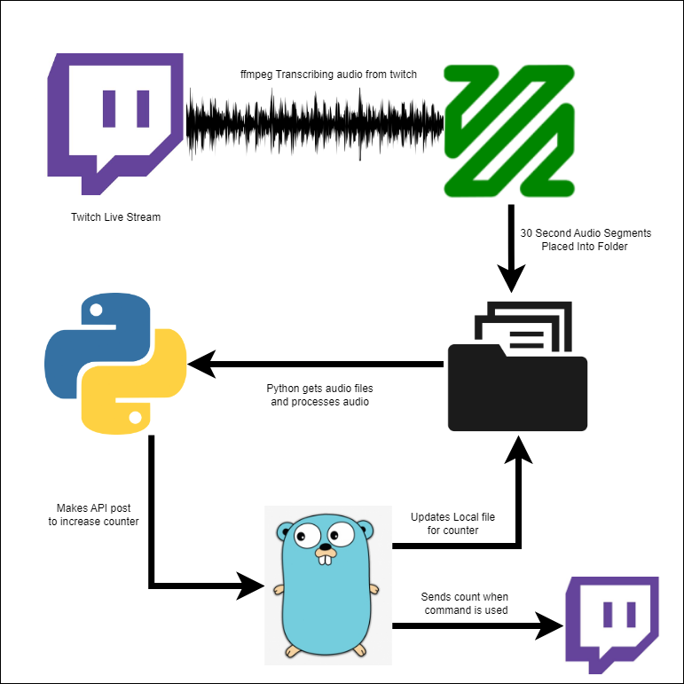

# Samantha Bot

Samantha is a Twitch bot that utilizes research from Project Temporal to monitor audio from a Twitch stream for the use of profanity. It is built using ffmpeg for audio processing, golang for the backend, and python for the interface. The bot counts the number of times the word "fuck" is used in the stream's audio.

# what is ffmpeg 

FFmpeg is a free, open-source, command-line software that can be used to record, convert, and stream audio and video. It supports a wide variety of codecs and file formats, and is commonly used for video encoding, decoding, and manipulation.

<code>
ffmpeg -i "https://usher.ttvnw.net/api/channel/hls/..." -vn -c:a aac -b:a 128k -segment_time 10 -f segment audio/output_%03d.aac
</code>

This command tells ffmpeg to take the input from the specified m3u8 URL, to ignore any video (-vn), and to copy the audio codec into 30-second segments, and to save each segment to a separate file using the %03d pattern..

# How does it get the words?
OpenAI's Whisper is a high-quality voice synthesis model that can be used to generate natural-sounding speech. It is based on the Transformer architecture and can be fine-tuned on a specific speaker's voice, making it capable of generating speech in different accents and languages.

In the context of a project, Whisper can be used to loop through an array of files that are added to a directory. The process would involve first converting the text data in the files to speech using Whisper, and then updating a counter in a local file through a post request. The looping mechanism is implemented using python that continuously monitors the directory for new files and processes them as they are added.

The time of the segments from the ffmpeg script can be fine used to  allow for real-time conversion of text to speech or just normal processing over time as new files are added to the directory, allowing for automatic processing without human intervention.

It's worth noting that OpenAI API's including Whisper are not public anymore, you need to apply for access, pay for usage or run stright from the ground up.

# Golang? Why?

Go, is a programming language developed by Google that is often used for building backend systems. In the context of this project its a Twitch bot to send updates to the Twitch chat when a specific command is called. Golang is also being used to process API calls to keep track of the counter allowing for max efficiency.

The Go programming language also provides built-in support for concurrency, which allows multiple tasks to be executed simultaneously. This can be useful in a Twitch bot & the api caller because it allows for the processing of multiple commands or requests at the same time, without slowing down the overall performance of the bot.

Additionally, Golang is a compiled language which makes it a good choice for performance-sensitive applications, and it also provides good support for cross-compilation, making it easy to deploy the bot on different platforms.

In summary, Golang is a suitable choice for building the backend of a Twitch bot because it provides robust support for handling network connections, concurrency, and performance-sensitive applications. It's well suited to handle the api calls and updates to the Twitch chat when the command `?fbomb` is called.

# Summary 

The project architecture for the Twitch bot that uses OpenAI's Whisper, ffmpeg and golang, includes utilizing Whisper for converting text to speech, ffmpeg for extracting audio from a m3u8 stream and splitting it into 30-second segments, and golang for the backend to process API calls, and sending updates to the Twitch chat when the command `?fbomb` is called.